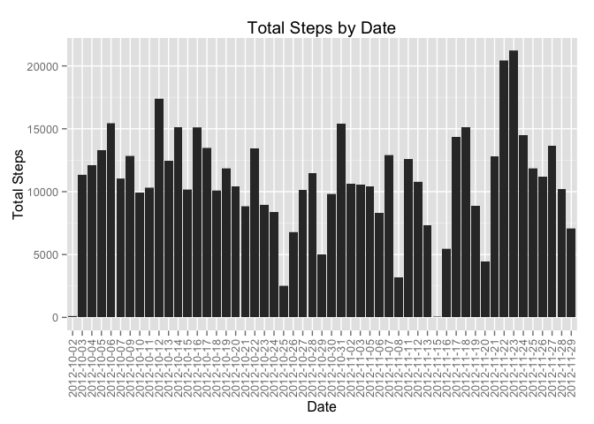

# Reproducible Research: Peer Assessment 1


## Loading and preprocessing the data

```r
# load up our libraries
library(dplyr)
library(ggplot2)
```


```r
# unzip the data file
unzip("activity.zip")
# read the csv
data <- read.csv("activity.csv")
dataTable <- tbl_df(data)
```

## What is mean total number of steps taken per day?

For this part of the assignment, you can ignore the missing values in
the dataset.

1. Make a histogram of the total number of steps taken each day


```r
# ignore missing values
data2 <- data[complete.cases(data),]
# plot our histogram
g <- ggplot(data2, aes(date, steps))
g + geom_bar(stat="identity") + xlab("Date") + ylab("Total Steps") + ggtitle("Total Steps by Date") + theme(axis.text.x=element_text(angle=90,hjust=1,vjust=0.5))
```

 

2. Calculate and report the **mean** and **median** total number of steps taken per day


```r
# get a vector with total steps per day
totalStepsPerDay <- tapply(data2$steps, data2$date, sum)
# then we can calculate mean and median on it
meanSteps <- mean(totalStepsPerDay, na.rm = TRUE)
medianSteps <- median(totalStepsPerDay, na.rm = TRUE)
```
~~~
The mean is: 10766.189     
The median is: 10765.000
~~~

## What is the average daily activity pattern?

1. Make a time series plot (i.e. `type = "l"`) of the 5-minute interval (x-axis) and the average number of steps taken, averaged across all days (y-axis)


```r
# calculate mean, group by interval
meanPerInterval <- tapply(data2$steps, data2$interval, mean, na.rm = TRUE)
# create the dataframe where we can plot
intervalData <- cbind(read.table(text = names(meanPerInterval)), meanPerInterval)

g <- ggplot(intervalData, aes(V1, meanPerInterval))
g + geom_line() + xlab("5-minute Interval") + ylab("Mean steps taken") + ggtitle("Mean Steps Taken per 5-minute Interval")
```

 

2. Which 5-minute interval, on average across all the days in the dataset, contains the maximum number of steps?


```r
# get the named vector containing the interval with the maximum value
maxInterval <- meanPerInterval[meanPerInterval >= max(meanPerInterval)]
intervalName <- names(maxInterval)[1]
```
~~~
The interval containing the maximum number of steps is interval 835.
~~~

## Imputing missing values
Note that there are a number of days/intervals where there are missing
values (coded as `NA`). The presence of missing days may introduce
bias into some calculations or summaries of the data.

1. Calculate and report the total number of missing values in the dataset (i.e. the total number of rows with `NA`s)


```r
# select NAs in steps into a data frame, then count the rows
naCount <- nrow(data[is.na(data$steps),])
```
~~~
The number of rows with NAs is: 2304.
~~~

2. Devise a strategy for filling in all of the missing values in the dataset. The strategy does not need to be sophisticated. For example, you could use the mean/median for that day, or the mean for that 5-minute interval, etc.


```r
# create a copy of the data, where we will fill in the NAs
dataFilled <- data

# now, loop every row
# for every row with steps NA, look up our previous calculated average interval steps
# in intervalData and assign the average steps of that interval to replace the NA value
for (i in 1:nrow(dataFilled))
{
    if (is.na(dataFilled$steps[i]))
    {
        dataFilled$steps[i] <- intervalData[intervalData$V1 == dataFilled$interval[i],]$meanPerInterval
    }
}
```
~~~
My strategy is, for the interval of the day that has a NA value, I will fill it with the computed mean for that interval across all days.
~~~

3. Create a new dataset that is equal to the original dataset but with the missing data filled in.

This is the new dataset that we've created with NAs filled in the previous step:

```r
head(dataFilled)
```

```
##       steps       date interval
## 1 1.7169811 2012-10-01        0
## 2 0.3396226 2012-10-01        5
## 3 0.1320755 2012-10-01       10
## 4 0.1509434 2012-10-01       15
## 5 0.0754717 2012-10-01       20
## 6 2.0943396 2012-10-01       25
```

4. Make a histogram of the total number of steps taken each day and Calculate and report the **mean** and **median** total number of steps taken per day. Do these values differ from the estimates from the first part of the assignment? What is the impact of imputing missing data on the estimates of the total daily number of steps?


```r
g <- ggplot(dataFilled, aes(date, steps))
g + geom_bar(stat="identity") + xlab("Date") + ylab("Total Steps") + ggtitle("Total Steps by Date") + theme(axis.text.x=element_text(angle=90,hjust=1,vjust=0.5))
```

 

```r
# get a vector with total steps per day
totalStepsPerDayFilled <- tapply(dataFilled$steps, dataFilled$date, sum)
# then we can calculate mean and median on it
meanStepsFilled <- mean(totalStepsPerDayFilled, na.rm = TRUE)
medianStepsFilled <- median(totalStepsPerDayFilled, na.rm = TRUE)
```
~~~
The mean is: 10766.189     
The median is: 10766.189

Comparing the mean and median with the first part of the assignment, the mean is the same, however, the median differs.

By imputing mising data, we have shifted the median of the data towards the mean.
~~~


## Are there differences in activity patterns between weekdays and weekends?
